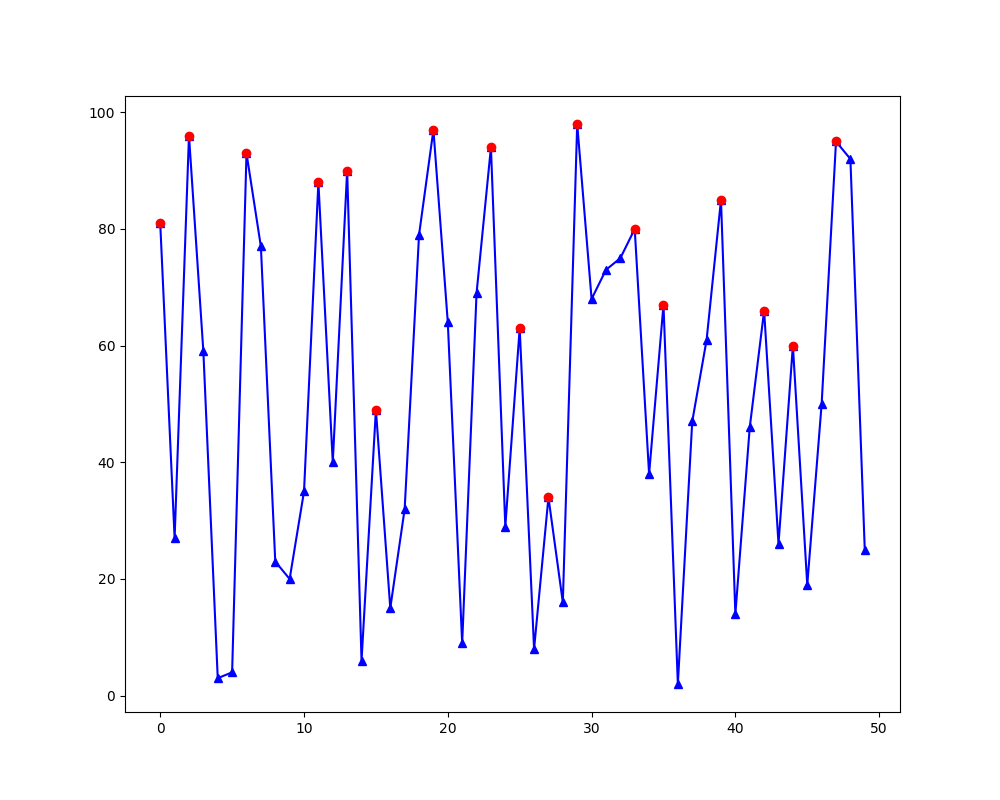
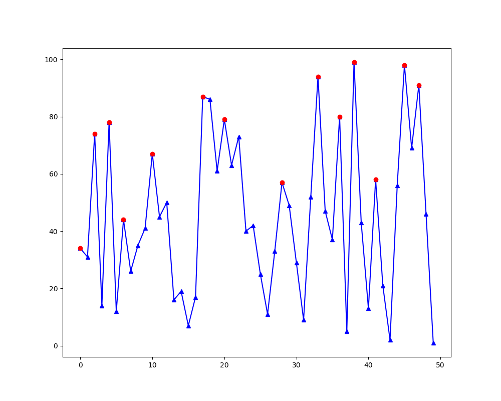

# peak_finder
Lightweight algorithm to find peaks in single point streaming data

```Python
def peak_finder(thresh=0):
    """ Returns initialized function to detect peaks on live streaming data.
       Args:
           thresh (int): The amplitude threshold in which peaks are recognized.
       Returns:
           function object: The function that detects peaks in streaming data.
    """
    
    last = 0  # Track last input value
    ascent_dist = 0  # Distance from last trough.
    ascent_start = None  # Last trough height

    def detect_peak(data):
        """ Returns data value if data is determined to be a peak, else returns None.
            Args:
                data (numeric value): Input data point.
            Returns:
                If peak is detected return peak value, else return None
        """
        
        nonlocal last, ascent_dist, ascent_start
        if data > last:
            if ascent_start is None:
                ascent_start = last
            ascent_dist += 1
        else:
            if ascent_dist:
                peak = last
                ascent_dist = 0
                if (peak - ascent_start) > thresh:
                    last = data
                    ascent_start = None
                    return peak
                ascent_start = None
        last = data
        return None

    return detect_peak
```

## Example:
```Python
import matplotlib.pyplot as plt
import random

pf = peak_finder(10)
sample_data = random.sample(range(1, 100), 50)
peak_data = [pf(num) for num in sample_data]

fig = plt.figure(figsize=(10, 8))
ax = fig.add_subplot(111)

ax.plot(sample_data, marker='^', color='b')
ax.plot(peak_data[1:], marker='o', color='r')

plt.show()
```
 


